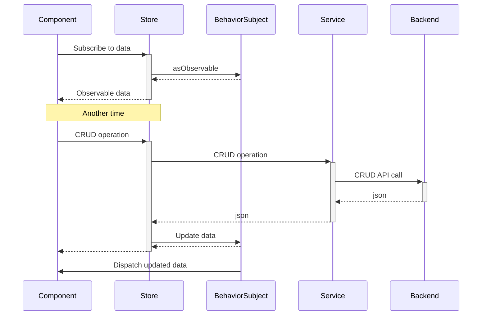

## Dépendances

- Angular Material
- TailwindCSS (Angular Flex Layout deprecated)
- DateFns (Moment.js deprecated)

## Structure du projet

### Services

En charge des échanges API avec le backend Java.

!!! INFO
	Sauf mention contraire, le format d'entrée et de sortie des endpoints HTTP est `application/json`, et les **id** ne sont pas présents dans le document lors de la création (appels **POST**).

### Stores

En charge de fournir les données aux composants.
Implémentation à l'aide d'un pattern [Data Services](https://blog.angular-university.io/how-to-build-angular2-apps-using-rxjs-observable-data-services-pitfalls-to-avoid/) (RxJs BehaviorSubject)

### Arborescence

Découpage de l'application en modules pour permettre un un chargement en 2 temps dans le cadre du SSO

- root : Contient uniquement la partie authentification
- main : Contient l'application complète

- src/app
	- services/AuthenticationSvc
	- main
		- components
		- pages
		- modules
		- services
		- stores
  
## Sécurité, gestion des droits et contraintes

L'application Angular est en charge de :

- masquer les contrôles associés à des rôles que l'utilisateur n'a pas
- s'assurer que les données saisies sont conformes aux contraintes de la BDD
- s'assurer que l'utilisateur possède les droits demandés avant d'accepter de naviguer vers une page (voir [Router](Router.md))

L'application Spring est responsable de :

- vérifier les droits utilisateurs avant d'effectuer une action, et de générer une erreur le cas échéant
- valider les contraintes sur les données et de générer une erreur le cas échéant