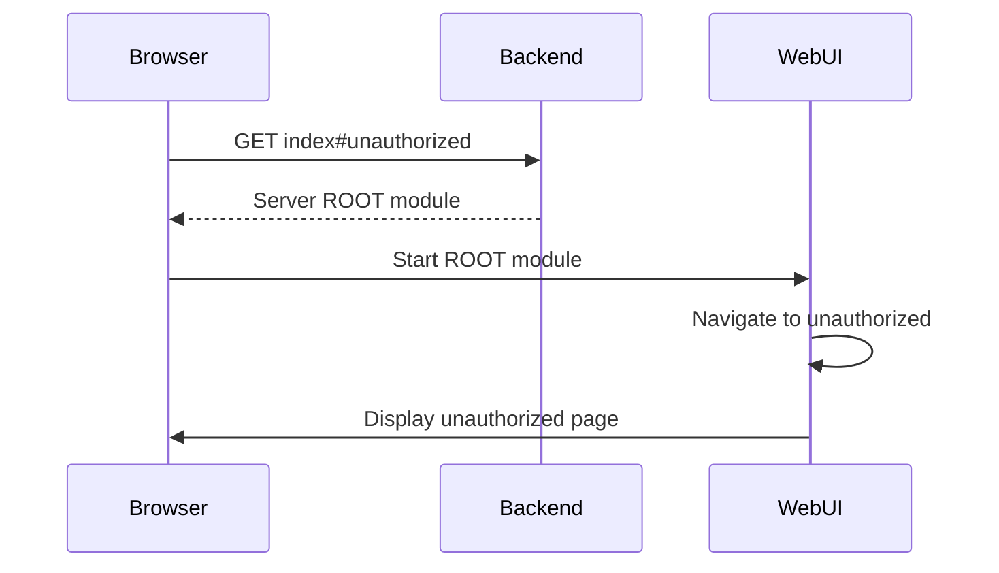

# Bootstrap en erreur

Démarrage de l'application Angular dans le cas d'une erreur d'authentification

```mermaid
sequenceDiagram
	participant Browser
	participant Backend
	participant WebUI
 
	Browser ->> Backend: GET index#35;unauthorized
	Backend -->> Browser: Server ROOT module
	Browser ->> WebUI: Start ROOT module
    WebUI ->> WebUI: Navigate to unauthorized
	WebUI ->> Browser: Display unauthorized page
```

