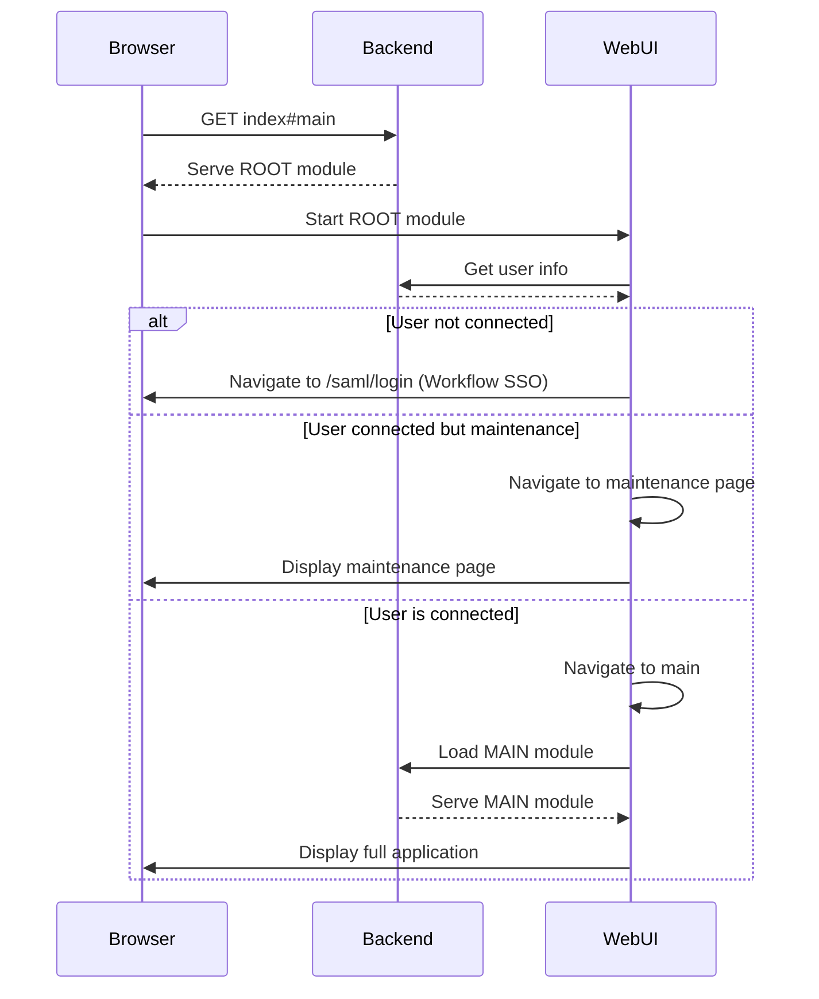

# Bootstrap application

```mermaid
sequenceDiagram
	participant Browser
	participant Backend
	participant WebUI
 
	Browser ->> Backend: GET index#35;main
	Backend -->> Browser: Serve ROOT module
	Browser ->> WebUI: Start ROOT module
	WebUI ->> Backend: Get user info
    Backend -->> WebUI: 
    alt User not connected
        WebUI ->> Browser: Navigate to /saml/login (Workflow SSO)
    else User connected but maintenance
        WebUI ->> WebUI: Navigate to maintenance page
        WebUI ->> Browser: Display maintenance page
    else User is connected
	    WebUI ->> WebUI: Navigate to main
	    WebUI ->> Backend: Load MAIN module
	    Backend -->> WebUI: Serve MAIN module
	    WebUI ->> Browser: Display full application
    end
```

