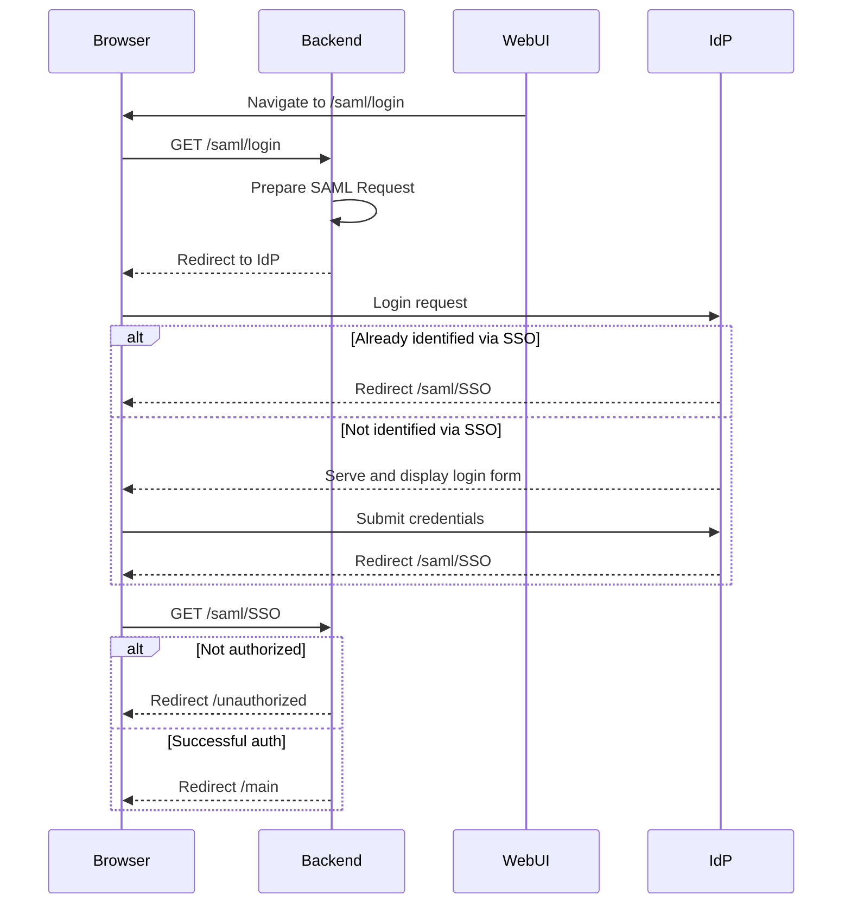

# Workflow SSO

Flux SSO entre le backend Java et ADFS Transdev

```mermaid
sequenceDiagram
	participant Browser
	participant Backend
	participant WebUI
 
	WebUI ->> Browser: Navigate to /saml/login
	Browser ->> Backend: GET /saml/login
	Backend ->> Backend: Prepare SAML Request
	Backend -->> Browser: Redirect to IdP
	Browser ->> IdP: Login request
	
	alt Already identified via SSO
		IdP -->> Browser: Redirect /saml/SSO
	else Not identified via SSO
		IdP -->> Browser: Serve and display login form
		Browser ->> IdP: Submit credentials
		IdP -->> Browser: Redirect /saml/SSO
	end

	Browser ->> Backend: GET /saml/SSO
	
	alt Not authorized
		Backend -->> Browser: Redirect /unauthorized
	else Successful auth
		Backend -->> Browser: Redirect /main
	end
```