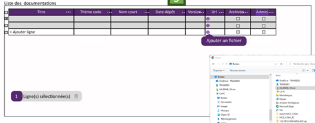

Un tableau permettant l'affichage et la suppression des documentations.

## Implémentation

L'édition est accessible via un bouton présent sur chaque ligne, et la création de nouvelles documentations via un bouton général. Ces deux actions ouvrent un [formulaire sous forme de popup](../../Composants/Documentation/DocumentationPopupForm.md).

Le tableau doit supporter la sélection multiple pour permettre d'appliquer les actions **archiver** et **supprimer** en masse.

!!! warning
    La suppression ne doit être possible que si la documentation est archivée

## Utilisation des services

- [DocumentationStore](../../Store/DocumentationStore.md)