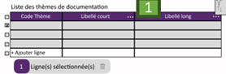

Un simple tableau permettant l'affichage et la suppression des thèmes de documentation.

L'édition est accessible via un bouton présent sur chaque ligne, et la création de nouveaux thèmes via un bouton général qui ouvre un [formulaire sous forme de popup](./DocumentationThemePopupForm.md).

## Utilisation des services

- [DocumentationStore](../../Store/DocumentationStore.md)