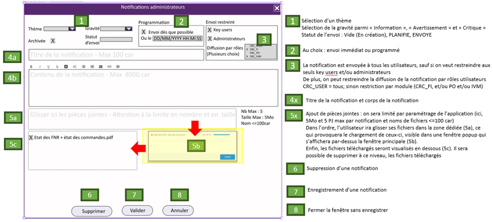

Formulaire de création et d'édition de notification.

Selon la présence ou non d'une propriété `notification` le formulaire devra s'adapter au mode *édition* ou *création*.

Le formulaire doit suivre les [règles de validation](/Interfaces/Notification/#contraintes_1) des notifications.

Il doit également permettre à l'utilisateur de joindre plusieurs fichiers à associer à la notification.

## Input

`notification?: Notification`

## Utilisation des services

- [NotificationStore](/Store/NotificationsStore)

## Ressources

- [Angular File Upload](https://blog.angular-university.io/angular-file-upload/)
- [Angular Rich Text Editor](https://github.com/kolkov/angular-editor)
