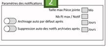

Un simple formulaire permettant de mettre à jour les paramètres liés aux notifications.

## Validation : 

- maxSize: strict positive
- maxAttachments: strict positive
- delayBeforeArchive: strict postive
- delayBeforeClean: strict postive

## Utilisation des services

- [SettingsStore](../../../Store/SettingsStore)