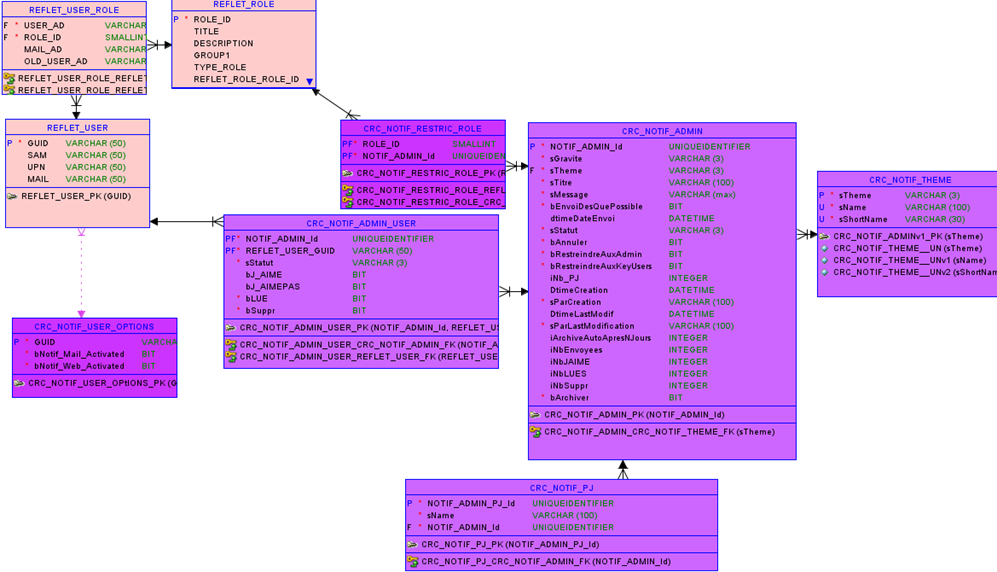

Détails des interfaces pour les fonctionnalités liées aux notifications. Les traitements associés sont gérés par le [store notification](../Store/NotificationsStore.md) et le [service notification](../Services/NotificationsSVC.md).


- NotificationTheme : permet de regrouper plusieurs notifications
- Notification : une notification à destination d'un utilisateur
- NotificationTemplate : permet la création et l'édition des notifications par un administrateur


## Types de base

```ts
type NotificationID = number
type NotificationThemeID = string
type NotificationTemplateID = number

enum NotificationGravity {
	INFORMATION = "inf"
	WARNING = "war"
	CRITICAL = "cri"
}

enum NotificationStatus {
	CREATED = "cre"
	SCHEDULED = "sch"
	SENT = "sen"
}
```


## Interface **NotificationTheme**

### Typescript

```ts
interface NotificationTheme {
	id: NotificationThemeID
	name: string
	shortName: string
	itemsCount: number
}
```

!!! info
		`itemsCount` n'apparait pas explicitement dans la spécification fonctionnelle d'origine mais est nécessaire pour empêcher la suppression d'un thème lorsque celui-ci est utilisé par des notifications.

### Contraintes

- name: strlen <= 100
- shortName: strlen <= 30

## Interface **Notification**

### TypeScript

```ts
interface Notification {
	id: NotificationID
	read: boolean
	liked: boolean
	disliked: boolean
	deleted: boolean
	gravity: NotificationGravity
	theme: NotificationThemeID
	title: string
	message: string
	hasAttachments: boolean
	date: Date
}
```


## Interface **NotificationTemplate**
### Typescript

```ts
interface NotificationTemplate {
	id: NotificationTemplateID
	gravity: NotificationGravity
	theme: NotificationThemeID
	title: string
	message: string
	sendASAP: boolean
	sendDate: Date
	adminsRestricted: boolean
	keyUsersRestricted: boolean
	rolesRestricted: UserRoles[]
	
	// The following fields are used by the backend and only read by Angular
	status: NotificationStatus
	createdAt: Date
	createdBy: string
	updatedAt: Datetime
	updatedBy: string
	sentCount: number
	likedCount: number
	dislikedCount: number
	readCount: number
	deletedCount: number
	archived: boolean
	archivedAt: Date
}
```

### Contraintes

- title: strlen <= 100
- message: strlen <= 8000
- createdBy : strlen <= 100
- updatedBy : strlen <= 100
## MCD d'origine


